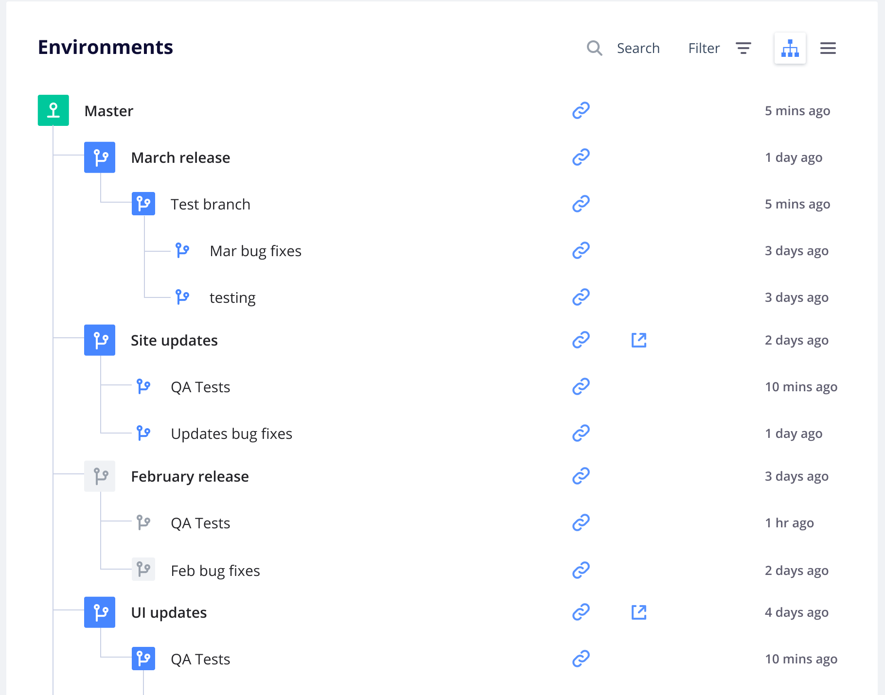

**Last updated 2nd June 2021**


## Objective  

An environment on Web PaaS is a logically separate instance of an application, complete with all of the services that application requires. You can think of an environment as a complete working website, related to, but safely isolated from others in the project.

Each project includes multiple environments--typically the production environment and three or more additional environments which can be used for development, testing, staging, review, etc. 

New environments can be created in moments through a Git clone, via the [Web PaaS Command Line Interface](/pages/web_cloud/web_paas_powered_by_platform_sh/development-cli), or via the [Web PaaS web console](/pages/web_cloud/web_paas_powered_by_platform_sh/administration-web), and will be an exact replica of their parent environments. This means new environments will have all of the data, as well as the services (like databases, network storage, queues, routing, etc.) instantly cloned. 

The relationships between environments is hierarchical, and can be organized in any way that suits your organization, rather than mandating a strict development → staging → production workflow. An environment is tied to a Git branch and can be created on demand. With Bitbucket and GitHub integrations you can even get a "development server" automatically for each and every pull request.

You can have branches that are not tied to a running instance of your application; these are what we call "inactive environments".

## Default branch

Every Web PaaS project starts with a Master environment which corresponds to the Master branch in Git.

If you subscribed to a production plan, this environment is your **live site** and can be mapped to a domain name and a custom SSL certificate.

> [!primary]  
> Your project must have a default branch, but you can configure it to be a different branch than `master`. 
> 


## Hierarchy



Web PaaS brings the concept of a hierarchy between your environments. Each new environment you create is considered a **child** of the **parent** environment from which it was branched.

Each child environment can sync code and/or data down from its parent, and merge code up to its parent. These are used for development, staging, and testing.

When you create a branch or child environment through the Web PaaS management console the branch it was made from will be treated as the parent.  If you create a branch through your local Git checkout and push it to Web PaaS, or synchronize a branch from a 3rd party such as GitHub or Bitbucket, its parent will default to the master branch.

Any environment's parent can be changed using the Web PaaS CLI with the following command:

```bash
webpaas environment:info parent NEW_PARENT
```

In this case, the current environment (the branch you're on) will be set to have `NEW_PARENT` as its parent environment.  The environment to reparent can be set explicitly with the `-e` option:

```bash
webpaas environment:info -e feature-x parent NEW_PARENT
```


## Workflows

Since you can organize your environments as you want, you have complete flexibility to create your own workflows.

There are no rules you must follow when branching the master environment. You simply need a structure that best fits your workflow:

* **Agile**: a child environment per sprint. Each story in the sprint can have its own environment as a child of the sprint environment.
* **Developer-centric**: one QA environment and a few development environments (*per developer, per task...*).
* **Testing**: an operational test environment, a user test environment and a few unit test environments.
* **Hotfix**: one environment for every bug, security, or hotfix that needs deployment.

Here is an example of a possible Agile workflow.


The administrator creates a Sprint environment and gives each of the developers permission to create new feature environments. Another approach is that the administrator could create an environment for each developer.

------------------------------------------------------------------------

As a feature is completed, the administrator can review the work by accessing the website of the feature environment. The new feature is then merged back into the Sprint environment.

------------------------------------------------------------------------


The remaining features will sync with the Sprint environment to ensure their working environment is up-to-date with the latest code.

------------------------------------------------------------------------


When the objectives of the sprint are complete, the administrator can then make a backup of the live site, then merge the Sprint environment into the live (Master) environment.

------------------------------------------------------------------------

The administrator can then synchronize the next sprint's environment with data from the live (Master) environment to repeat and continue the development process.

## Naming conventions

Web PaaS provides great flexibility on the way you can organize and work with your development environments. To improve readability and productivity, it's important to think carefully about how to name and structure those environments.

The name should represent the purpose of the environment. Is it a Staging site to show to your client? Is it an implementation of a new feature? Is it a hotfix?

If you use Agile, for example, you could create hierarchical environments and name them like this:

```text
Sprint1
  Feature1
   Feature2
   Feature3
Sprint2
  Feature1
  Feature2
  ...
```

If you prefer splitting your environments per developer and having a specific environment per task or per ticket, you could use something like this:

```text
Staging
  Developer1
    Ticket-526
    Ticket-593
  Developer2
    Ticket-395
  ...
```
