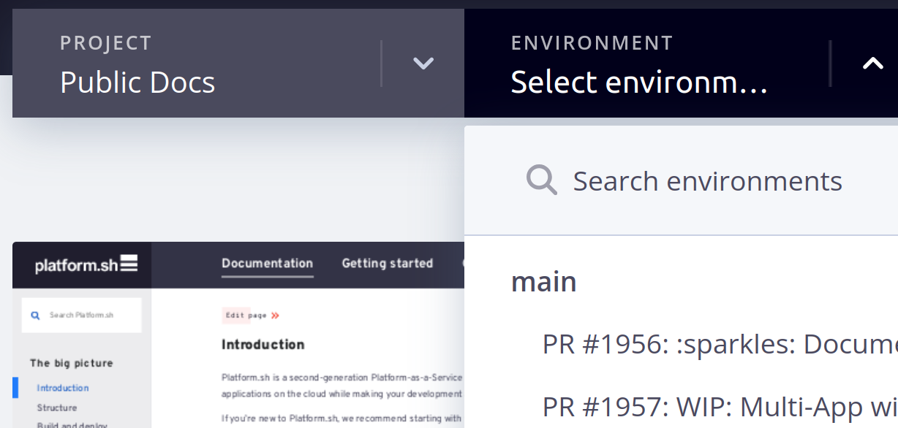
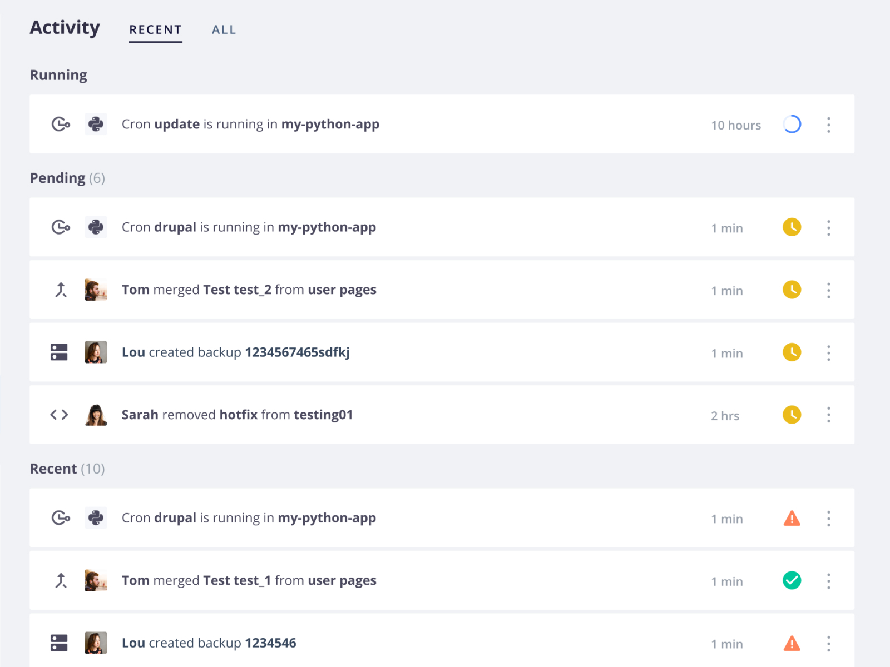
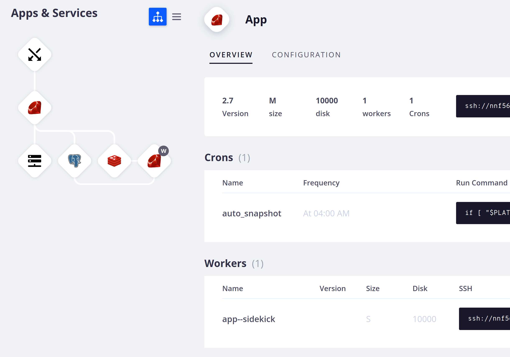
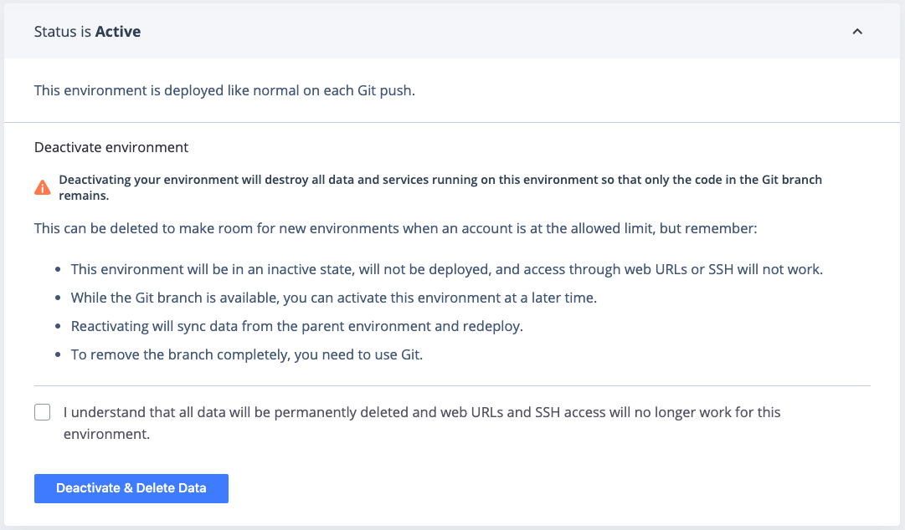

## Objective  

From your project's main page, each environment is available from the **Environment** menu.

There is also a graphic view of your environments where you can view your environments as a list or a project tree.
The names of inactive environments are lighter.

Once you select an environment, you can see details about it.

## Activity Feed

You can see all the activity happening on your environments.
You can filter activities by type.

## Actions

Each environment offers ways to keep environments up to date with one another:

*  **Branch** to create a new child environment.
*  **Merge** to copy the current environment into its parent.
* **Sync**
  to copy changes from its parent environment into the current environment.

There are also additional options:

* **Settings** to [configure the environment](#environment-settings).
* **More** to get more options.
* **URLs** to access the deployed environment from the web.
* **SSH** to access your project using SSH.
* **Code**
  * **CLI** for the command to get your project set up locally with the [Web PaaS CLI](/pages/web_cloud/web_paas_powered_by_platform_sh/development/development-cli).
  * **Git** for the command to clone the codebase via Git.
  
    If you're using Web PaaS as your primary remote repository, the command clones from the project.
    If you have set up an external integration,
    the command clones directly from the integrated remote repository.

    If the project uses an external integration to a repository that you haven't been given access to,
    you can't clone until your access has been updated.
    See how to troubleshoot source integrations.

## Service information

You can also view information about how your routes, services, and apps are currently configured for the environment.

To do so, click **Services**.
By default, you see configured routes.

### Routes

The **Router** section shows a list of all configured routes.
For each, you can see its type and whether caching and server side includes have been enabled for it.

To see your `.platform/routes.yaml` file that led to these routes, click **Configuration**.

### Applications

To see more detailed information about an app container, click it in the tree or list.

The **Overview** gives you information about your app.
You can see the language version, the container size, the amount of persistent disk,
the number of active workers and cron jobs, and the command to SSH into the container.

You can also see all cron jobs with their name, frequency, and command.

To see the YAML file that led to this configuration, click **Configuration**.

### Services

To see more detailed information about a running service, click it in the tree or list.

The **Overview** gives you information about the given service.
You can see the service version, the container size, and the disk size, if you've configured a persistent disk.

To see your `.platform/services.yaml` file that led to these routes, click **Configuration**.

## Environment settings

To see settings for a given environment, click **Settings** within that environment.

### Environment name

The first setting allows you to modify the name of the environment and view its parent environment.

### Status

The **Status** setting shows whether or not your environment is active.
For non-Production environment, you can change their status.

### Outgoing emails

You can allow your environment to [send outgoing emails](/pages/web_cloud/web_paas_powered_by_platform_sh/development/development-email).

### Search engine visibility

This setting enables you to tell search engines to ignore the site.

### HTTP access control

This setting enables you to control access using HTTP methods.

### Variables

Under **Variables**, you can define the [environment variables](/pages/web_cloud/web_paas_powered_by_platform_sh/development/development-variables).

