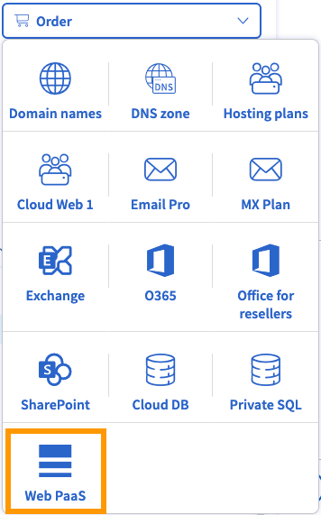
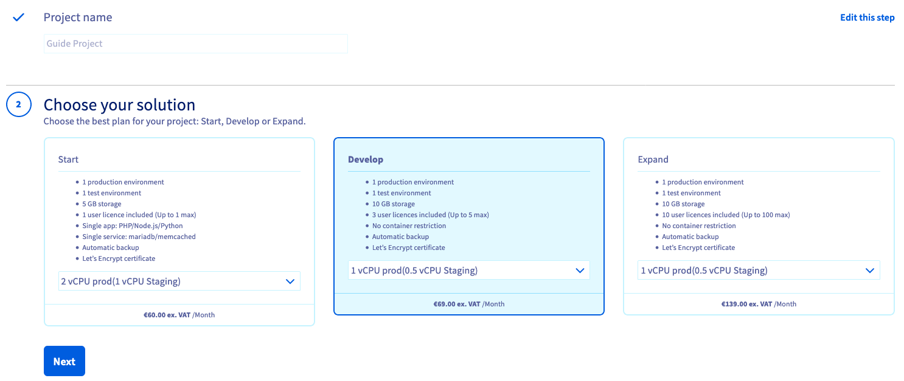
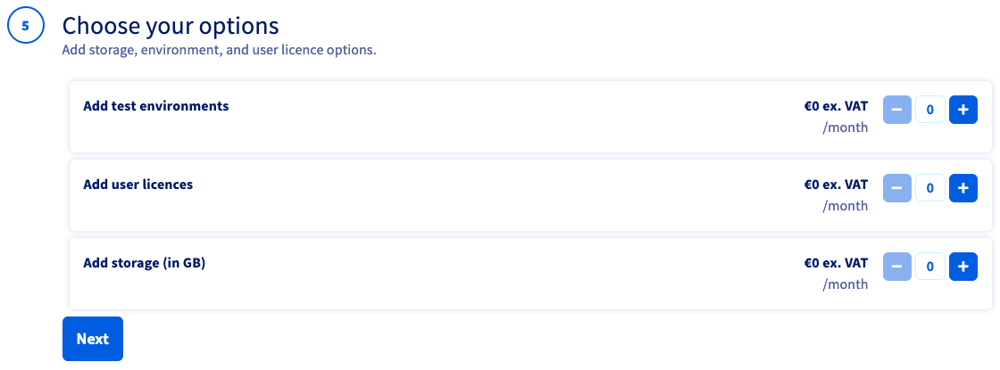
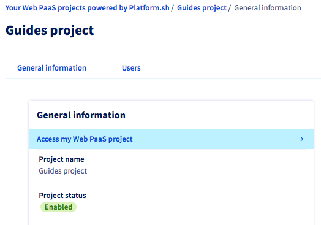
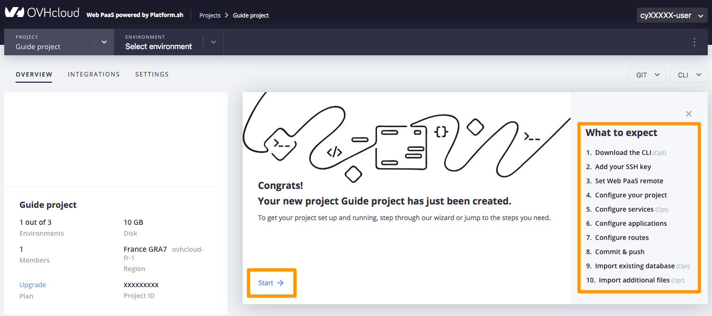
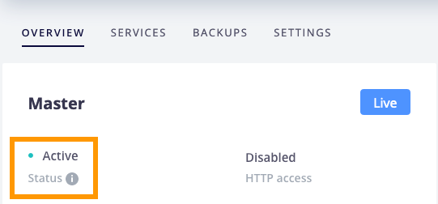

## Objective

OVHcloud Web PaaS powered by Platform.sh enables web developers to manage, develop and deploy applications by offering a centralised collaborative solution with numerous integrated features.

**This guide explains how to order and preconfigure your Web PaaS solution in the OVHcloud Control Panel.**

<iframe width="560" height="315" src="https://www.youtube-nocookie.com/embed/EcEBhxuDCDo" title="YouTube video player" frameborder="0" allow="accelerometer; autoplay; clipboard-write; encrypted-media; gyroscope; picture-in-picture" allowfullscreen></iframe>

## Requirements

- Access to the [OVHcloud Control Panel](https://www.ovh.com/auth/?action=gotomanager&from=https://www.ovh.co.uk/&ovhSubsidiary=GB)
- Visiting the [product page](https://www.ovhcloud.com/en-gb/web-paas/) to decide which plan is suitable for your project's requirements

## Instructions

### Subscribing to the service

Log in to your [OVHcloud Control Panel](https://www.ovh.com/auth/?action=gotomanager&from=https://www.ovh.co.uk/&ovhSubsidiary=GB) and switch to `Web Cloud`{.action} in the top navigation bar.

Select `Web PaaS`{.action} in the services bar on the left-hand side, then click on the button `New project`{.action}.

{.thumbnail}

#### Step 1: Name your project

Give your project a name and click on `Next`{.action}.

#### Step 2: Choose a plan

Select a plan that best suits your needs after verifying the details and capabilities on the [product page](https://www.ovhcloud.com/en-gb/web-paas/). If necessary, increase the number of vCPUs in the drop-down menu of the chosen solution.

You can upgrade or downgrade the project later in the Control Panel. Note that a downgrade to the `Start`{.action} plan will not be possible after creating the project.

{.thumbnail}

#### Step 3: Select the region

Choose the geographical region of the data centre in which your project will be hosted.

{.thumbnail}

#### Step 4: Select the project type

- If the project relies on your own pre-existing code, you will be able to import it: click on `Create your template`{.action} and continue with `Next`{.action}.

- If you click on `Select an existing template`{.action}, the list of available templates will be displayed along with their properties. You can check the [product page FAQ](https://www.ovhcloud.com/en-gb/web-paas/) to find out which templates are included in the respective plan. Select one and click on `Next`{.action}.

{.thumbnail}

#### Step 5: Configure your project

In this step you can choose additional resources for the project, according to the plan you have selected. Please refer to our [product page](https://www.ovhcloud.com/en-gb/web-paas/) for details about the available **Environments**, **Storage**, and **User licences** for each plan.

{.thumbnail}

The options chosen here can be modified in the Control Panel later. Note that it will not be possible to downgrade **Storage** after it has been increased.

#### Step 6: Proceed to complete your order

Finally, review the order summary and click on `Create a project`{.action} to confirm. This will initiate the payment process.

> [!primary]
> You can order the service from the [product page](https://www.ovhcloud.com/en-gb/web-paas/) as well.
>
> Each project requires a separate service subscription. In order to add a project, simply repeat the steps above.

After the payment process is completed, the project will be deployed and you will be able to log in to the Management Console from the OVHcloud Control Panel.

#### Step 7: Check the availability of your project for build and deploy

On your project's `General information` page, click on `Access my Web PaaS project`{.action}.

{.thumbnail}

You will be redirected to the `OVERVIEW` tab of the Web PaaS Management Console.

Here you can follow the configuration wizard to guide you through the first steps with your project. Click `Start`{.action} to follow all the steps. Alternatively, you can directly select one of the wizard steps on the right.

{.thumbnail}

The project is ready when the status is set to `Active` on the Master environment.

{.thumbnail}

### Getting started with a Web PaaS project

#### Configuring the CLI

The first step with an active project is usually to install the Web PaaS CLI in your local working environment. Download the Web PaaS CLI by copying the **_curl_ command provided in the Wizard** into your local Terminal application.

The Web PaaS CLI installer will provide further instructions and provide a **URL to be opened in your web browser**. This is necessary to grant access to your user account. (You might be prompted to log in with your OVHcloud credentials at this point). Click on the button `Yes, authorize`{.action} to finish the CLI configuration.

#### Configuring SSH keys

The next step is to add SSH keys to your user account.

- If you would like to use an existing local key, enter the command `webpaas ssh-key:add` in the Web PaaS CLI. Your public key can be added in the Wizard or in the `Account`{.action} settings of your Web PaaS Management Console.
- If you need to create a new key pair, we recommend to follow the steps in the [SSH guide](/pages/web_cloud/web_paas_powered_by_platform_sh/development/development-ssh).

#### Downloading the project

The final step to get started with a project is to downlad it in order to work on it locally. Simply enter `webpaas get` in your Web PaaS CLI and you will be able to select it from the list of your projects.

## Go further

[Configuring the CLI](/pages/web_cloud/web_paas_powered_by_platform_sh/development/development-cli)

[Using SSH](/pages/web_cloud/web_paas_powered_by_platform_sh/development/development-ssh)

[Using YAML](/pages/web_cloud/web_paas_powered_by_platform_sh/configuration/configuration-yaml)

[Managing Web PaaS from the OVHcloud Control Panel](/pages/web_cloud/web_paas_powered_by_platform_sh/getting_started/control-panel-managing-the-service)

Join our community of users on <https://community.ovh.com/en/>.
