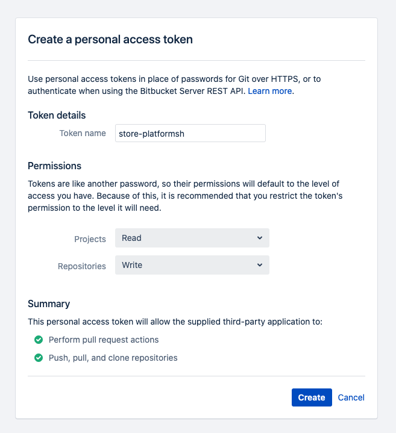

## Objective  

The Bitbucket integration allows you to manage your Web PaaS environments directly from your Bitbucket repository.

It is possible to integrate a Web PaaS project with either the freely available Bitbucket Cloud product, or with the self-hosted [Bitbucket Server](https://confluence.atlassian.com/bitbucketserver/). In both cases, you will need to [install the Web PaaS CLI](/pages/web/web-paas/development-cli#installation) if you have not already done so to set up the integration.

> [!primary]  
> If the repository you are trying to integrate with a Web PaaS project has a default branch that is not `master` (e.g. `main`), there are a few additional steps you will need to perform to setup the integration.
> 

## Bitbucket Cloud

### 1. Set up an OAuth consumer

You can integrate your Bitbucket repositories with Web PaaS by creating an [OAuth consumer](https://confluence.atlassian.com/bitbucket/oauth-on-bitbucket-cloud-238027431.html) for your Workspace.

1\. Go to your Bitbucket Workspace and click "Settings".

2\. Under "APPS AND FEATURES" click "OAuth Consumers".

3\. Click the "Add consumer" button.

4\. Fill out the information for the consumer. In order for the integration to work correctly, it's required that you include:

    * **Name:** Give the consumer a recognizable name, like `Web PaaS consumer` or `Web PaaS integration`.
    * **Callback URL:** The URL users will be redirected to after access authorization. It is sufficient to set this value to `http://localhost`.
    * **Set as a private consumer:** At the bottom of the "Details" section, select the "This is a private consumer" checkbox.
    * **Permissions:** Sets the integration permissions for Web PaaS. These permissions will create the webhooks that will enable Web PaaS to mirror actions from the Bitbucket repository.
      * **Account** - Email, Read
      * **Repositories** - Read, Write
      * **Pull requests** - Read
      * **Webhooks** - Read and write
5\. After you have completed the form, `Save` the consumer.

6\. After you have saved, you will see your consumer listed in the "OAuth consumers" section. If you open that item, it will expose two variables that you will need to complete the integration using the Web PaaS CLI: `Key` and `Secret`.

### 2. Enable the integration

Retrieve a `PROJECT_ID` for an existing project with `webpaas project:list` or create a new project with `webpaas project:create`.

Then run the integration command:

```bash
 webpaas integration:add --type=bitbucket --project <PLATFORMSH_PROJECT_ID> --key <CONSUMER_KEY> --secret <CONSUMER_SECRET> --repository <USER>/<REPOSITORY>
```

where

* `PLATFORMSH_PROJECT_ID` is the project ID for your Web PaaS project.
* `CONSUMER_KEY` is the `Key` variable of the consumer you created.
* `CONSUMER_SECRET` is the `Secret` variable of the consumer you created.
* `USER/REPOSITORY` is the location of the repository.

## Bitbucket Server

### 1. Generate a token

To integrate your Web PaaS project with a repository on a Bitbucket Server instance, you will first need to create an access token associated with your account. Click the avatar icon in the top right-hand corner, and then select "Manage account". From your account settings go to "Personal access tokens", and then "Create a token".

Name the token, and give it at least "Read" access to projects and "Write" access to repositories.



Copy the token and make a note of it (temporarily).

### 2. Enable the integration

Retrieve a `PROJECT_ID` for an existing project with `webpaas project:list` or create a new project with `webpaas project:create`.

Then run the integration command:

```bash
webpaas integration:add --type=bitbucket_server --project <PLATFORMSH_PROJECT_ID> --base-url=<BASE_URL> --username=<USERNAME> --token=<TOKEN> --repository=<REPOSITORY>
```

Where

* `PLATFORMSH_PROJECT_ID` is the project ID for your Web PaaS project.
* `BASE_URL`: The base URL of the server installation.
* `USERNAME`: Your Bitbucket Server username.
* `TOKEN`: The access token you created for the integration.
* `REPOSITORY`: The repository  (e.g. 'owner/repository').

## Validate the integration

In both cases, you can verify that your integration is functioning properly [using the CLI](/pages/web/web-paas/integrations-overview#validating-integrations) command:

```bash
webpaas integration:validate
```

## Optional parameters

By default several parameters will be set for the Bitbucket integration. They can be changed using the `webpaas integration:update` command.

* `--fetch-branches`: Track and deploy branches (true by default)
* `--prune-branches`: Delete branches that do not exist in the remote Bitbucket repository (true by default)
* `--build-pull-requests`: Track and deploy pull-requests (true by default)
* `--build-pull-requests-post-merge`: `false` to have Web PaaS build the branch specified in a PR. `true` to build the result of merging the PR.  (`false` by default)
* `--pull-requests-clone-parent-data`: Set to `false` to disable cloning of parent environment data when creating a PR environment, so each PR environment starts with no data. (`true` by default)

For more information see:

```bash
webpaas help integration:update
```

> [!primary]  
> The `--prune-branches` option depends on `--fetch-branches` being enabled. If `--fetch-branches` is disabled, `--prune-branches` will automatically be set to false, even if specifically set to true.
> 

## Clones and commits

When you run `webpaas get <projectID>` or use the clone command shown in the "Git" dropdown in the management console to clone the project, you will actually be cloning from your remote integrated repository, so long as you have the appropriate access to do so. 

Your Bitbucket repository is considered by Web PaaS to be the "source of truth" for the project. The project is only a mirror of that repository, and all commits should be pushed only to Bitbucket.
